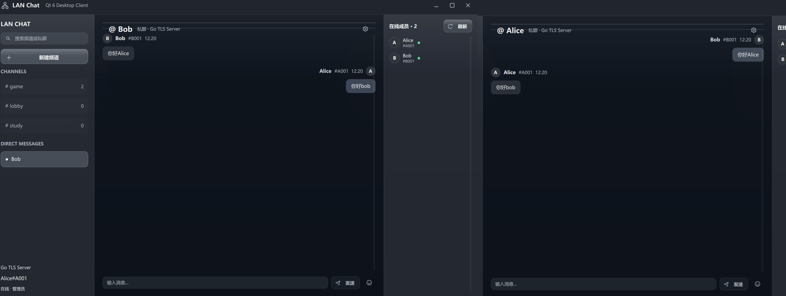
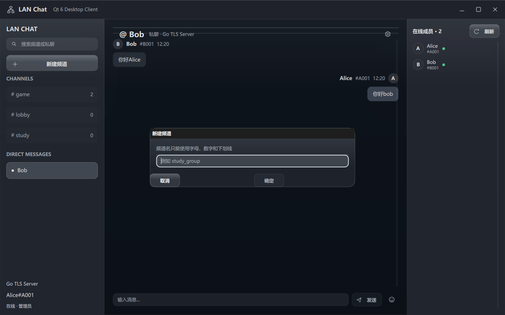
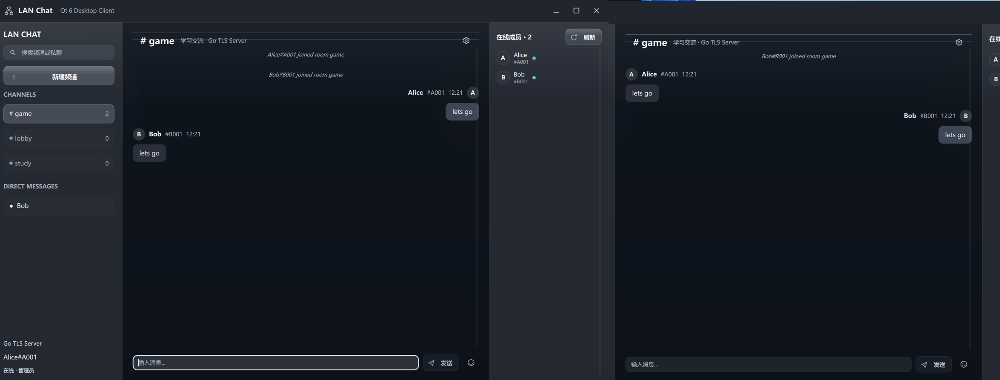

# Cross-Language LAN Chatroom

一个面向 Windows 局域网的跨语言多人聊天室：Go 负责 TLS/TCP 服务端，C++20 + Qt 6 负责桌面客户端。项目使用自定义的“4 字节大端长度头 + UTF-8 JSON”应用层协议，避免 TCP 字节流产生的粘包、拆包和半包问题。

> 适合学习 TCP Socket、跨语言协议、Go 并发、Windows 网络开发与 Qt Quick 桌面界面设计。

## 项目亮点

- Go TLS Server：监听 `0.0.0.0:8888`，支持 Wi-Fi 与以太网设备互通。
- C++/Qt 6 GUI Client：独立接收线程与 QML 界面线程分离，收消息不会阻塞输入。
- 多客户端群聊：用户名可重复，但“用户代码”忽略大小写且全局唯一，例如 `Alice#A001`。
- 频道与私聊：创建频道、切换频道、在线成员列表、自动刷新和未读提示。
- 可靠协议：4-byte Big-Endian 长度头、UTF-8 JSON、`send_all` / `recv_all` 与 64 KiB 上限。
- 安全连接：Go 服务端与 C++ 客户端通过 TLS 通信；私钥只保存在运行服务端的主机。
- 消息体验：发送者名称、代码与时间；自己消息靠右、他人消息靠左；支持 Emoji、复制、引用和本地删除。

## 界面展示

私聊：双方消息各自显示发送者、用户代码和时间，自己发送的消息右对齐。



创建频道：频道名称只允许字母、数字和下划线。



频道群聊：不同客户端可加入同一频道并实时收发消息。



## 架构

```text
Qt 6 Client A ─┐
Qt 6 Client B ─┼── TLS / TCP :8888 ── Go Server
Qt 6 Client C ─┘
```

服务端采用 Hub 模型：Hub goroutine 串行管理客户端、注册、注销和广播；每位客户端分别拥有读写流程。客户端使用 Winsock2/OpenSSL 处理网络与 TLS，Qt Worker Thread 处理收发，QML 只负责界面呈现。

## 通信协议

```text
┌──────────────────────┬──────────────────────────┐
│ 4-byte payload size  │ UTF-8 JSON payload       │
│ uint32, big-endian   │ {"type":"chat", ...}   │
└──────────────────────┴──────────────────────────┘
```

长度字段表示 JSON 的**字节数**，而不是字符数量；最大消息体为 64 KiB。完整字段与消息类型见 [docs/protocol.md](docs/protocol.md)。

## 环境要求

- Windows 11
- Go 1.25 或更高版本
- Qt 6.11 MinGW 64-bit
- CMake 3.21+、Ninja
- OpenSSL 3.x 运行库

## 本机构建

构建并测试 Go 服务端：

```powershell
cd server-go
go test ./...
go build -o chat-server.exe .
```

构建 Qt GUI：

```powershell
cd client-cpp\gui
cmake -S . -B build -G Ninja
cmake --build build --parallel 2
```

## 运行方式

先启动服务端。证书和私钥只应位于服务端主机的本地目录，且不能提交到 GitHub。

```powershell
.\server-go\chat-server.exe -addr 0.0.0.0:8888 `
  -cert .\certs\server-lan.crt `
  -key .\certs\server-lan.key `
  -db .\server-go\chat.db
```

然后启动 GUI：

```powershell
.\client-cpp\gui\build\lan-chat-gui.exe
```

本机测试时填写 `127.0.0.1:8888`。局域网测试时，客户端应填写运行 Go Server 那台电脑的 IPv4 地址与端口 `8888`，并选择同一份 `server-lan.crt` 作为 CA 文件；客户端不需要、也不应获得私钥。

## 正式发布包：房主与成员使用同一个程序

正式版提供单一 Windows 包：`LANChat-v1.0.1-Windows-x64.zip`。解压后运行 `lan-chat-gui.exe`，在首页按角色选择：

- **创建本地聊天室（房主）**：本机启动包内的 Go TLS Server；生成并保管证书、私钥和数据库。
- **加入局域网聊天室（成员）**：填写房主电脑的 IPv4 与端口 `8888`，仅使用房主提供的公开证书 `server-lan.crt`。
- **远程服务器**：连接已经部署好的 Go TLS Server。

公开包不会包含证书、私钥、数据库或聊天记录。私钥 `server-lan.key` 只能留在房主电脑，成员绝不能获取。完整的中文步骤、PowerShell 命令和局域网排错方式见 [docs/release-setup.md](docs/release-setup.md)。

## 局域网测试

在服务端主机查看 IPv4：

```powershell
ipconfig
```

在另一台电脑测试 TCP 可达性：

```powershell
Test-NetConnection <服务端IPv4> -Port 8888
```

若连接失败，请检查 Windows 防火墙的 Private Network 入站规则、路由器 AP/Client Isolation、VLAN 和网络是否允许设备互访；不要关闭整个防火墙。

## 项目结构

```text
server-go/          Go TLS/TCP 服务端、Hub、协议与账户存储
client-cpp/         C++ Socket/TLS 协议客户端
client-cpp/gui/     Qt 6 / QML 桌面客户端
docs/               协议、架构、局域网测试与设计文档
scripts/            PowerShell 构建、启动与打包脚本
screenshots/        README 使用的真实测试截图
```

## 已验证内容

- localhost 双客户端登录、群聊、私聊与 UTF-8 中文消息
- 自定义频道创建、切换和成员列表刷新
- Alice 主机与 Bob 客户端的 TLS 连接
- 发送者名称、用户代码、时间与左右消息布局
- Wi-Fi 客户端连接以太网服务端的局域网测试
- Go 服务端单元测试与 Qt/CMake 构建

## 当前限制

- 仅支持群聊和一对一私聊；无公网 NAT 穿透。
- 无文件、图片、语音或视频传输。
- 消息历史查询功能暂未提供。
- 服务端的管理员撤回协议已保留，但完整的管理员可视化菜单仍在后续计划中。
- 局域网环境使用自签名证书；更换服务端 IP 后需重新签发包含该 IP 的证书。

## 后续方向

- 完善管理员菜单与频道权限。
- 增加可检索的本地历史记录。
- 增加房间密码、TLS 证书管理与正式部署配置。
- 探索 Linux、Android 或 Web 客户端。

## 简历描述参考

独立开发 Go 与 C++ 跨语言局域网多人聊天室，基于 TCP Socket 设计 4 字节长度头 + JSON 协议解决粘包与拆包；Go 服务端利用 goroutine/channel 管理并发连接与广播，C++ 客户端使用 Winsock2、OpenSSL 与 Qt 6 实现 TLS 异步收发、频道和私聊，并完成跨 Wi-Fi/以太网设备通信验证。
