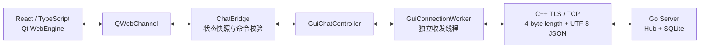
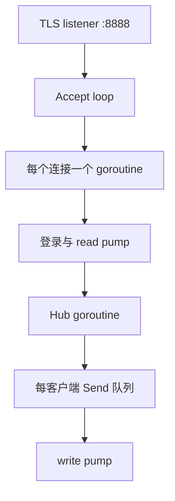

# LAN Chat 架构

## 正式客户端路径

正式用户界面为 React + Qt WebEngine。React 只负责界面状态和用户交互，不直接处理 socket、TLS、证书、密码、线程或数据库。`ChatBridge` 是 Web UI 与既有 C++ 业务层之间唯一的桥接边界。

React 生产资源先由 Vite 构建，再嵌入 Qt 资源系统，运行时从 `qrc:/frontend/index.html` 加载。因此发布包不需要 Node.js，开发者源码路径才需要 Node.js 用于构建。

## Go 服务端

服务端负责 TLS 连接、账号校验、频道/私信分发、离线私信、管理员操作和 SQLite 消息持久化。Hub 是在线连接与广播状态的唯一拥有者，避免多个 goroutine 并发修改共享状态。

## 局域网自动发现

房主在本地模式启动 Go Server 后，会以 UDP `38888` 每秒公告房主名称、TCP 端口、**公开** TLS 证书及其 SHA-256 指纹。Qt 客户端监听该端口，并以数据报来源 IPv4 作为实际连接地址；因此 DHCP、切换 Wi-Fi 或路由器重连导致的 IPv4 改变不需要重新配置。

成员选择房主并点击“确认并加入”后，`LanDiscoveryService` 仅把公开证书保存到应用配置目录的 `known-hosts`，C++ TLS 层继续用 OpenSSL 对该证书及 `localhost` 身份进行校验。私钥、数据库和消息内容不会出现在 UDP 公告或成员机配置中。首次发现属于“首次确认并固定证书”流程；在不可信局域网，应额外通过可信渠道核对 UI 显示的证书指纹。

## 发布边界

| 路径 | 面向对象 | 是否携带私钥 / 数据库 | 是否自动编译 |
| --- | --- | --- | --- |
| 统一运行包 `LANChat-Windows-x64.zip` | 房主和局域网成员 | 否；仅房主本机首次运行时生成 | 否 |
| 源码启动器包（可选） | 开发者 | 否；房主本机运行时生成 | 首次确认后允许 |

统一运行包由 `LANChat.exe` 作为入口，包含已部署 GUI 与 `server-go\chat-server.exe`，但不包含初始证书、私钥或数据库。启动器在房主电脑第一次打开时生成本机 `server-lan.key`、`server-lan.crt` 和 `chat.db`，随后 GUI 创建房间并启用局域网公告。成员默认在附近房间列表中确认并加入；仅在自动发现受网络限制时才需要手动填写 IPv4 和 `server-lan.crt`。

## 兼容与诊断

QML 代码仍保留在源码中，仅用于内部故障诊断：现代构建默认启动 WebEngine，运行 `lan-chat-gui.exe --legacy-qml` 才会显式进入 QML 回退界面。旧 CLI 客户端不再属于 README、发布包或默认构建入口。
