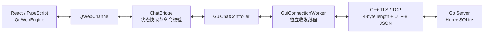
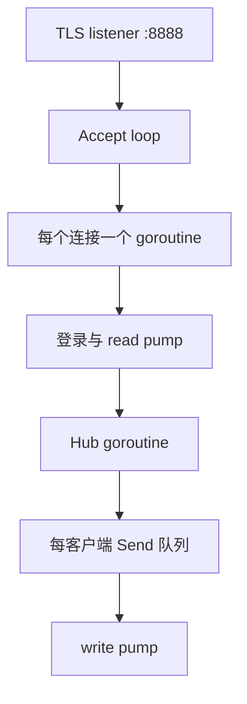

# LAN Chat 架构

## 正式客户端路径

正式用户界面为 React + Qt WebEngine。React 只负责界面状态和用户交互，不直接处理 socket、TLS、证书、密码、线程或数据库。`ChatBridge` 是 Web UI 与既有 C++ 业务层之间唯一的桥接边界。

React 生产资源先由 Vite 构建，再嵌入 Qt 资源系统，运行时从 `qrc:/frontend/index.html` 加载。因此发布包不需要 Node.js，开发者源码路径才需要 Node.js 用于构建。

## Go 服务端

服务端负责 TLS 连接、账号校验、频道/私信分发、离线私信、管理员操作和 SQLite 消息持久化。Hub 是在线连接与广播状态的唯一拥有者，避免多个 goroutine 并发修改共享状态。

## 发布边界

| 路径 | 面向对象 | 是否携带私钥 / 数据库 | 是否自动编译 |
| --- | --- | --- | --- |
| 源码启动器包 | 房主、开发者 | 否；房主本机运行时生成 | 首次确认后允许 |
| 成员测试包 | 局域网成员 | 否 | 否 |

`server-lan.key` 只存在于房主机。成员仅使用房主提供的 IPv4、端口和 `server-lan.crt`。

## 兼容与诊断

QML 代码仍保留在源码中，仅用于内部故障诊断：现代构建默认启动 WebEngine，运行 `lan-chat-gui.exe --legacy-qml` 才会显式进入 QML 回退界面。旧 CLI 客户端不再属于 README、发布包或默认构建入口。
