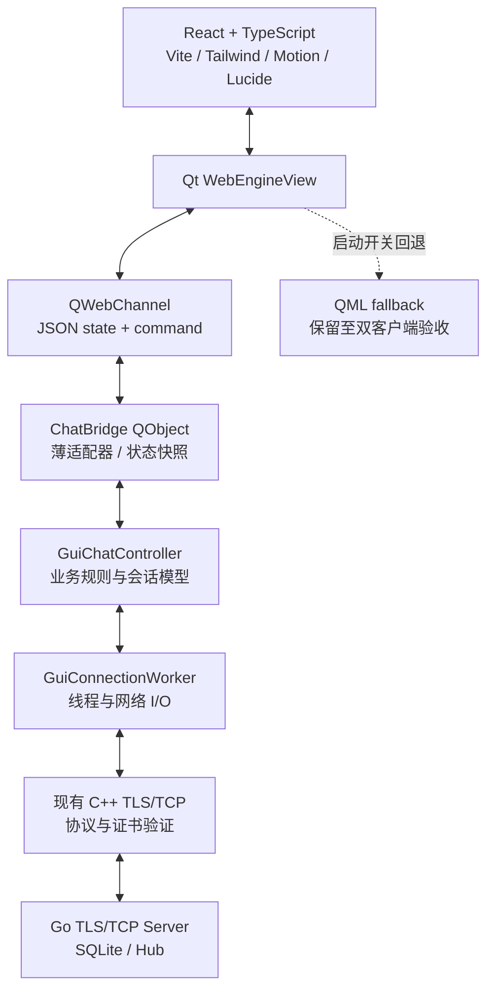

# React/QWebEngine 极光玻璃 UI 设计规格

日期：2026-08-21  
状态：待用户审阅；本规格不授权实现  
适用仓库：`C:\Users\jking1\Desktop\my-project\chat_X`

## 1. 目标与范围

将现有 Qt Quick/QML GUI 渐进迁移为同一 Qt 进程内的 Qt WebEngine + QWebChannel + React/TypeScript UI。迁移只替换界面层，现有 Go TLS/TCP 服务端、4 字节大端长度帧、JSON 协议、C++ Socket/TLS、Worker Thread、SQLite 和 `GuiChatController` 业务规则继续作为事实来源。

本阶段产出的是架构和界面规格，目标是让后续实现可以按页面拆分、可回退、可测试。首个实现阶段不包含真正端到端加密、文件/图片传输、UDP 发现、历史搜索、移动端、P2P、安装器或 QML 删除。

### 已确认的硬约束

- React 只能通过 QWebChannel 调用 `ChatBridge(QObject)`，不接触 Socket、TLS、密码、证书内容、线程或数据库。
- 开发期加载 `http://127.0.0.1:5173`；发布期加载 Qt Resource System 中的 `qrc:/frontend/index.html`，最终用户不需要 Node.js。
- 采用 React + TypeScript + Vite + Tailwind + Motion + Lucide；不引入 Electron、Next.js、Redux、Material UI 或 Ant Design。
- React 页面逐页迁移并保留 QML 回退，直到真实 TLS 双客户端验收完成后才允许移除 QML。
- 浏览器 GPU 加速保持 Qt WebEngine 默认设置；动画优先使用 `transform` 和 `opacity`。
- 人机可见文案以中文为主，数据和桥接字段使用稳定的英文键名，未来可接入 i18n。

## 2. 方案选择

### 方案 A：一次性重写 Qt GUI

删除 QML，直接建立完整 React/QWebEngine GUI。代码路径看似简单，但会同时改变启动、连接、聊天、频道、管理员操作和发布链路；任一桥接缺陷都会让用户无法回退到已验证 GUI，风险最高，拒绝采用。

### 方案 B：同进程渐进迁移，ChatBridge 作为单一 seam（推荐）

在现有 `GuiChatController` 之上增加薄的 `ChatBridge`，React 只消费 JSON 状态并发送 JSON 命令。先建立 WebEngine 宿主和 mock bridge，再迁移页面，最后用真实 TLS 双客户端验证。QML 与 React 共存期间由启动选项或构建开关选择 UI。

这个方案保留现有网络和业务实现，把变动集中在 UI seam；同时可以用相同的状态/命令 fixture 测试 React 和 C++ 桥接，具有较好的深度、局部性和回退能力。

### 方案 C：独立 Web 客户端进程

让 React 运行在单独的 Node/Electron 或本地 HTTP 进程中，再通过自定义 IPC 连接 C++。它会引入额外生命周期、打包和安全边界，也违背最终发布包不依赖 Node 的目标，拒绝采用。

## 3. 总体架构



### 模块职责

**React 应用模块**负责页面组合、局部 UI 状态、渲染、键盘交互、可访问性和视觉动效。它不解释服务器协议，不决定权限，不保存密码，也不直接读写本地文件。

**ChatBridge 模块**是 React 与 C++ 的唯一 seam。它负责 JSON 命令形状校验、调用现有 controller、把 Qt model/property/signal 转换成版本化 JSON 快照，并将错误转换成统一错误事件。它不复制频道权限、用户代码唯一性、TLS 或消息路由规则。

**GuiChatController 模块**继续拥有连接状态、会话选择、未读计数、频道/私聊模型、管理员入口和连接记忆。后续只允许做服务于桥接的加法，例如结构化错误信号或可序列化的模型观察点，不重写业务逻辑。

**QML fallback**继续使用原来的 context property 和 QML model。React 迁移代码不得为了方便而改变 QML 的现有调用契约。

## 4. 页面与交互结构

### 4.1 页面路由

| 路由/状态 | 目的 | 真实 controller 依赖 |
| --- | --- | --- |
| `mode` | 选择远程服务器、创建本地聊天室、加入局域网聊天室 | 无；读取启动能力状态 |
| `connect` | 输入 IP、端口、用户名、用户代码、密码和 CA 路径 | `saved*` 配置、`connectToServer` |
| `host` | 配置本机 Server、证书、私钥和数据库路径 | `connectToLocalHost`；路径只在本机传递 |
| `workspace` | 频道、私聊、消息、成员、频道管理 | 房间/私聊/成员/消息模型和动作 |
| `settings` | 连接记忆和显示偏好 | `savedConnectionChanged`；不显示密码 |

页面路由由 React 的轻量状态机控制，不引入 Redux。连接未成功时不得进入可发送的 workspace；连接丢失时 workspace 保留只读内容，并显示可重试的连接状态。

### 4.2 Workspace 布局

workspace 采用四层信息层级：

1. 左侧窄工作区轨道：应用标识、当前连接状态和全局动作。
2. 频道/私聊侧栏：搜索、频道列表、未读数、新建频道、私聊列表。
3. 中央聊天区：会话标题、状态/未读分界、消息时间线、输入区。
4. 右侧成员栏：在线人数、成员列表、成员资料和私聊入口。

窄窗口下右侧成员栏变成 modal/drawer，中央消息区保持主操作区域。固定左下角显示身份卡，例如 `Alice #A001 / 在线 · 管理员`；身份卡不得随消息列表滚动。

### 4.3 消息排列规则

每条消息都是一个独立的 `messageCluster`。自己发送的消息使用 `align-items: flex-end`，头像、名称、用户代码、时间和气泡共同位于同一个右对齐块内；气泡变宽或换行时，元数据仍保持右侧，不允许名称回到左侧。长文本使用安全断行，气泡最大宽度约为聊天区的 72%。

系统消息使用低干扰的居中分隔样式；引用、复制、本地删除和管理员撤回通过消息操作菜单进入。设计不新增历史搜索 UI，也不把本地删除误解为服务端删除。

### 4.4 视觉系统

视觉方向为丰富版 Aurora Glass，而不是对现有 QML 三栏做同构换肤：

- 背景：深午夜蓝，叠加蓝紫和青绿色极光渐变；粉色只作少量强调。
- 表面：高对比的半透明层、清晰边界和明确层级；正文使用近白色，辅助文字仍满足可读性。
- 玻璃效果：只在标题栏、侧栏、modal/popover 使用有限 blur；消息列表和单个消息项不使用实时 backdrop blur。
- 状态色：青绿色表示在线/成功，琥珀色表示连接中/注意，红色表示错误；颜色同时配合文字或图标，不单靠颜色传达含义。
- 动效：hover/显示过渡约 150ms，按下反馈约 50ms；使用 `ease-out` 的 transform/opacity，避免夸张弹跳。`prefers-reduced-motion` 时关闭非必要动效。
- 图标：Lucide 统一线性图标；不把图标当作唯一标签，关键动作同时有中文可访问名称。

建议初始 token（实现时集中在 `frontend/src/styles/tokens.css` 或 Tailwind theme）：

```text
background:       #070B18
surface:           rgba(17, 25, 50, 0.72)
surface-raised:   rgba(28, 39, 76, 0.86)
aurora-cyan:      #37F6D0
aurora-violet:    #8C7CFF
accent-pink:      #FF72BE
text-primary:     #F5F7FF
text-secondary:   #9AA7C4
status-online:    #48E0B0
```

这些值是设计基线，不是网络或业务常量；主题切换和 i18n 不进入第一迁移切片。

## 5. React 状态模型

React 只维护 UI 派生状态和最近一次 bridge snapshot。业务事实来自 `ChatBridge.currentState()` / `stateChanged`。

```ts
type ConnectionPhase =
  | "idle" | "connecting" | "connected" | "reconnecting" | "error";

type ConversationRef =
  | { kind: "room"; id: string; title: string }
  | { kind: "dm"; id: string; title: string; userCode: string };

type BridgeState = {
  schemaVersion: 1;
  connection: {
    phase: ConnectionPhase;
    statusText: string;
    retryable: boolean;
    lastError?: BridgeError;
  };
  identity: {
    displayName: string;
    userCode: string;
    admin: boolean;
  };
  navigation: {
    page: "mode" | "connect" | "host" | "workspace" | "settings";
    activeConversation?: ConversationRef;
  };
  rooms: RoomSummary[];
  directMessages: DirectMessageSummary[];
  activeMessages: MessageItem[];
  members: MemberSummary[];
  permissions: {
    activeRoomCanManage: boolean;
  };
  savedConnection: {
    serverIp: string;
    serverPort: number;
    username: string;
    userCode: string;
    caFile: string;
  };
};
```

`RoomSummary`、`DirectMessageSummary`、`MessageItem` 和 `MemberSummary` 的字段直接对应现有 `ChatListModel` roles，并保持稳定英文键名：`roomName`、`memberCount`、`unreadCount`、`ownerCode`、`private`、`canManage`、`displayName`、`userCode`、`time`、`content`、`selfMessage`、`systemMessage`、`online`、`admin`、`messageId`。

`activeMessages` 默认只序列化当前会话的可见窗口；实现时采用虚拟列表承载 500 条以上消息，避免一次性创建大量 DOM。该策略不恢复本地历史搜索，也不改变 controller 现有的模型上限。

密码、私钥内容、Socket、线程句柄、SQLite 路径以外的数据库内容和任何原始证书内容均不进入 `BridgeState`。`savedConnection.caFile` 仅为本地路径，密码不保存。

## 6. ChatBridge QWebChannel 契约

### 6.1 小接口

`ChatBridge` 暴露一个小接口，避免把现有 controller 的每个 C++ 方法逐一复制成前端 API：

```cpp
Q_INVOKABLE QString currentStateJson() const;
Q_INVOKABLE void dispatch(const QString& commandJson);

signals:
    void stateChanged(const QString& stateJson);
    void commandResult(const QString& resultJson);
    void bridgeError(const QString& errorJson);
```

QWebChannel 注册名固定为 `chatBridge`。`currentStateJson()` 只返回最近一次完整快照；React 首次连接后先读取它，再监听 `stateChanged`。`dispatch()` 不把 Qt 类型、指针或 QObject 暴露给网页。

### 6.2 命令 envelope

```json
{
  "id": "cmd-42",
  "type": "chat.sendRoom",
  "payload": { "content": "你好", "room": "lobby" }
}
```

命令类型和 payload：

| type | payload | controller 入口 |
| --- | --- | --- |
| `session.connectRemote` | `serverIp`, `serverPort`, `username`, `userCode`, `password`, `caFile`, `registerAccount` | `connectToServer` |
| `session.connectLocalHost` | `serverExe`, `certFile`, `keyFile`, `dbFile`, `username`, `userCode` | `connectToLocalHost` |
| `session.disconnect` | `{}` | `disconnectFromServer` |
| `chat.sendRoom` | `content`, `room` | `sendRoomMessage` |
| `chat.sendPrivate` | `content`, `targetUserCode` | `sendPrivateMessage` |
| `conversation.selectRoom` | `room` | `selectRoom` |
| `conversation.selectDirect` | `userCode` | `selectDirectMessage` |
| `conversation.openPrivate` | `displayName`, `userCode` | `openPrivateChat` |
| `directory.refreshUsers` | `{}` | `requestUsers` |
| `directory.refreshRooms` | `{}` | `requestRooms` |
| `room.create` | `room`, `isPrivate` | `createRoom` |
| `room.action` | `action`, `room`, `targetUserCode` | `sendRoomAction` |
| `admin.action` | `action`, `targetUserCode`, `messageId` | `sendAdminAction` |
| `message.copy` | `text` | `copyText` |
| `message.removeLocal` | `messageId` | `removeLocalMessage` |
| `message.recall` | `messageId` | `recallMessage` |

桥接层只校验 envelope、必填字段、类型和明显的空值；用户名、用户代码、频道名、权限、目标用户和消息发送结果仍由现有 controller/server 判定。密码只存在于一次 `session.connectRemote` 命令的内存 payload，不得写入 React store、快照、日志或 command result。

### 6.3 结果和错误

每个带 `id` 的命令返回一次：

```json
{
  "id": "cmd-42",
  "ok": false,
  "error": {
    "code": "connection_failed",
    "message": "无法连接到服务器",
    "retryable": true,
    "source": "controller"
  }
}
```

错误结构：

```ts
type BridgeError = {
  code: string;
  message: string;
  retryable: boolean;
  source: "bridge" | "controller" | "server" | "webengine";
  commandId?: string;
};
```

可预期错误必须展示中文 human message，同时保留稳定 `code` 供测试和后续本地化。React 对 `bridgeError` 使用 toast/inline error；连接错误进入连接状态卡；消息发送失败不能静默清空 composer。`commandResult` 只表示命令是否被接收或立即拒绝，服务器异步拒绝仍通过状态或错误事件反馈。

### 6.4 状态更新与生命周期

ChatBridge 监听 controller 的 property signal、`ChatListModel` 的 rows/reset/dataChanged 和连接事件，在短时间窗口内合并成一次完整快照。默认 coalesce 窗口为 16–50ms；连续消息不得为每个底层 signal 触发多次独立 QWebChannel 往返。

快照必须带 `schemaVersion`。字段增加时保持向后兼容；破坏性改变递增版本并让 React 显示受控错误页。WebEngine 页面刷新或 QWebChannel 重连后，React 重新读取 `currentStateJson()`，不得依赖事件重放恢复状态。

`main.cpp` 后续实现 WebEngine 宿主时负责：创建 `QWebEngineView`、创建 `QWebChannel`、注册 `chatBridge`、注入 channel、根据开发/发布模式选择 URL，并保留现有 QML loader 作为 fallback。开发 URL 只允许 loopback；发布 URL 只允许 qrc 资源。

## 7. 错误边界与安全边界

- React 根级 error boundary：渲染异常时显示“界面暂时不可用”和重新读取 bridge 状态按钮；不展示密码、私钥或原始异常栈。
- Bridge 解析错误：拒绝命令并返回 `invalid_command`，不调用 controller。
- QWebChannel 断开：状态变为 `webchannel_disconnected`，停止发送命令，显示重连提示；重连后重新 hydrate。
- 连接失败/丢失：保留已经收到的消息作为只读内容，显示重试入口；重试沿用 controller 的连接流程，不由 React 自己创建 Socket。
- 权限失败：显示服务器返回的中文错误；管理按钮根据 snapshot 隐藏或禁用，但最终权限仍由服务端决定。
- 文件/证书：React 只能传递用户选择的本地路径；私钥不会上传或发送给远程成员，密码不进入 QSettings、快照或日志。
- 发布安全：release 构建禁止加载任意外部 URL；开发模式显式标记为 development，并在发布脚本中校验 frontend dist 已嵌入。

## 8. 测试方案与验收标准

### 8.1 契约测试

建立一组 JSON fixtures，至少覆盖：初始未连接、连接中、已连接、房间列表、私聊列表、在线成员、自己发送的消息、系统消息、管理员权限、断线和错误。C++ 测试验证 `currentStateJson()` 可解析、字段稳定、密码/私钥不泄漏、非法命令返回 `invalid_command`；React 测试使用同一 fixtures 验证渲染和命令 payload。

### 8.2 React 测试

- route/state machine：mode → connect/host → workspace → settings，以及断线回到可重试状态。
- command adapter：每个 UI 动作生成正确 envelope；发送失败时 composer 保留内容。
- 消息排列：自己发送的名称、代码、时间和气泡始终成组右对齐；长文本换行不破坏元数据位置。
- 未读与会话隔离：频道、私聊独立显示消息和 unread count；选择会话清零对应未读。
- 键盘与可访问性：Tab 顺序、Enter 发送、Escape 关闭 modal、焦点恢复、中文 aria-label 和 reduced motion。
- 性能：超过 500 条消息时只渲染虚拟窗口，不为每条消息使用实时 blur。

### 8.3 C++/Qt 集成测试

- `ChatBridge` 能驱动现有 controller 的连接、断开、房间选择、私聊选择、消息发送、频道动作和管理员动作。
- QML fallback 构建和启动行为保持不变。
- WebEngine 页面加载 `qrc:/frontend/index.html`，QWebChannel 注册名为 `chatBridge`，资源缺失时显示受控错误而不是静默白屏。
- 开发模式只能连接 loopback Vite URL；发布模式不依赖 Node。

### 8.4 真实双客户端验收

在移除 QML 前，使用真实 TLS server 和两个客户端完成：连接/登录、中文群聊、私聊隔离、离线私信投递、频道创建/加入/邀请/移除/删除、管理员踢出/禁言/撤回、断线重连和 CA 校验。必须同时观察服务端日志、两个客户端 UI 和端口/进程清理；不能以 mock bridge 或单客户端截图替代。

### 8.5 完成定义

本设计进入实现前必须满足：

1. `BridgeState`、命令 envelope、结果/错误结构和页面状态机的字段已定型。
2. React 与 C++ 使用同一份契约 fixture。
3. QML fallback、开发 Vite、发布 qrc 三种加载路径都有明确测试入口。
4. 真实双客户端验收通过后，才允许评估移除对应 QML 页面。

## 9. 实施顺序（仅用于后续计划）

1. 建立 `ChatBridge` 契约类型、JSON fixture 和 C++ 序列化测试；不改变现有 GUI 默认入口。
2. 增加 Qt WebEngine/QWebChannel 宿主和最小 React shell，先实现 mock bridge 与 mode/connect 页面。
3. 迁移 workspace 的只读渲染：频道、私聊、成员、消息和身份卡；保留 QML 回退。
4. 接入真实 `ChatBridge`，完成发送、选择、未读、频道和管理员动作。
5. 做真实 TLS 双客户端回归、性能和发布包验证。
6. 仅在用户确认验收记录后，逐页关闭 QML fallback；本规格不预先批准删除 QML。
